<div align="center">

# 🧪 Omni-Lab: The Empirical Tutor

**A multimodal AI learning platform that transforms static content into interactive, verifiable, and visual lessons.**

[](https://react.dev/)
[](https://www.typescriptlang.org/)
[](https://vitejs.dev/)
[](https://ai.google.dev/)
[](LICENSE)

[**🌐 Live Demo**](https://golden007-prog.github.io/Omni-Lab/) · [**📖 DevPost**](#) · [**🐛 Report Bug**](https://github.com/Golden007-prog/Omni-Lab/issues)

</div>

---

## 📸 Screenshots

<div align="center">

|            Landing Page             |               Upload a PDF               |
| :---------------------------------: | :--------------------------------------: |
| 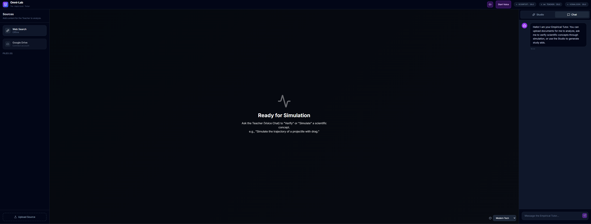 | 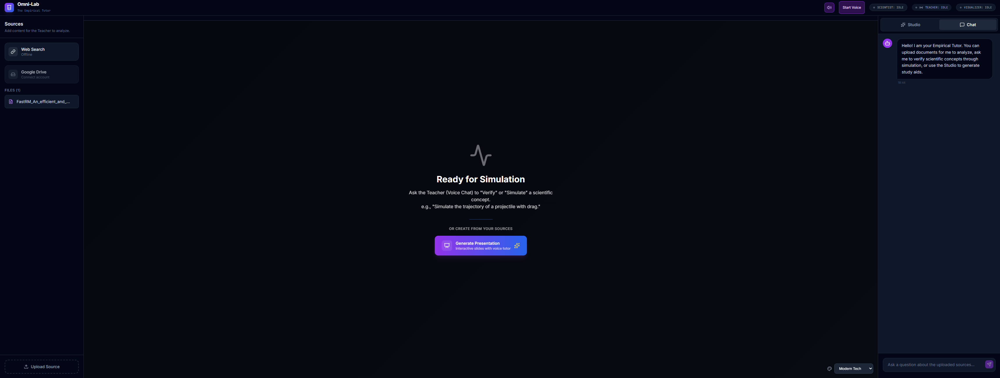 |

|                Generated Slides                 |              Auto-Explain in Action              |
| :---------------------------------------------: | :----------------------------------------------: |
| 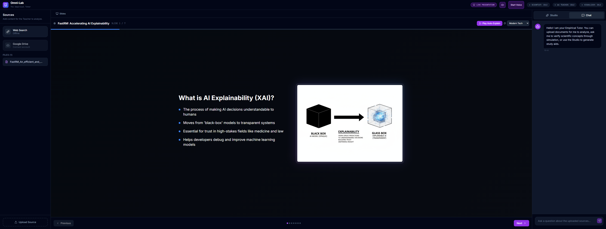 | 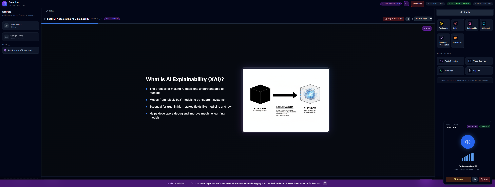 |

</div>

---

## 💡 Inspiration

We live in an era of information abundance but **"explanation poverty."** Students stare at static PDFs and textbooks, struggling to visualize complex concepts. Standard chatbots can answer questions, but they _tell_ without _showing_—and they can hallucinate facts without verification.

We wanted to build a tutor that acts like a **lab partner**:

1. 🔍 **See** what you are reading.
2. 📐 **Prove** concepts through math and simulation (Empirical).
3. 🎨 **Visualize** abstract ideas on the fly.

**Omni-Lab** was born from the idea that AI should be more than a text generator—it should be an **active participant** in the scientific method of learning.

---

## 🚀 What It Does

Omni-Lab is an autonomous educational workspace powered by **three specialized AI Agents**:

| Agent                 | Model                           | Role                                                       |
| --------------------- | ------------------------------- | ---------------------------------------------------------- |
| 🎓 **The Teacher**    | Gemini 2.5 Flash (Native Audio) | Real-time voice conversation, slide narration, Q&A         |
| 🔬 **The Scientist**  | Gemini 3 Pro                    | Analytical verification, code generation, live simulations |
| 🎨 **The Visualizer** | Gemini 3 Flash                  | Document → slides, flashcards, quizzes, infographics       |

---

### ✨ Key Features

<details>
<summary><b>📄 Auto-Lecture Generation</b></summary>
<br>
Upload any PDF and the system generates a full slide deck, then delivers a live voice-narrated presentation automatically.

|             Click Play to Auto-Explain              |                 AI Teaching Live                 |
| :-------------------------------------------------: | :----------------------------------------------: |
| 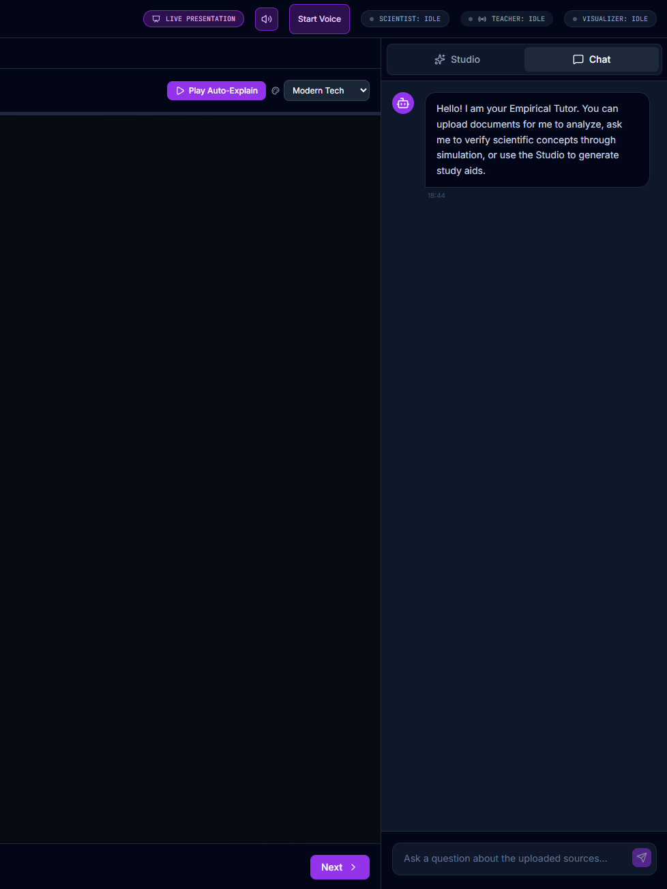 |  |

</details>

<details>
<summary><b>🎤 Live Voice Tutor</b></summary>
<br>
Ask questions by voice — the AI Teacher listens, understands your slides' context, and responds naturally. Supports real-time interruptions with local VAD (Voice Activity Detection).

|                Listening to Your Question                 |                Answered via Voice                |
| :-------------------------------------------------------: | :----------------------------------------------: |
|  | 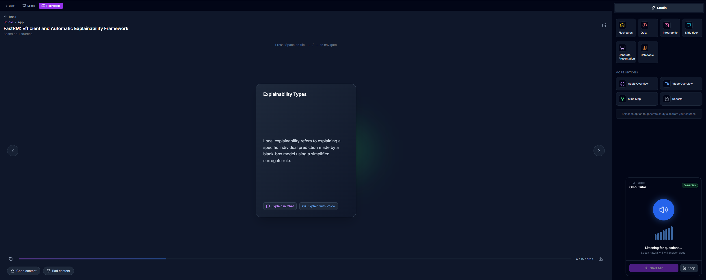 |

</details>

<details>
<summary><b>💬 Chat Explanations</b></summary>
<br>
Prefer text? Ask in the chat panel and receive detailed, contextual explanations alongside your slides.

|               Chat Explanation                |               Answer Detail                |
| :-------------------------------------------: | :----------------------------------------: |
| 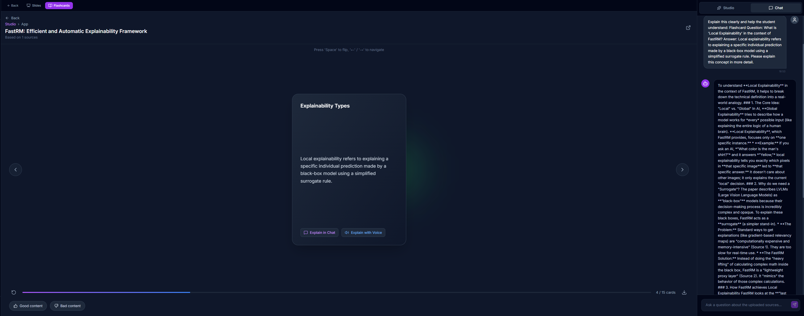 | 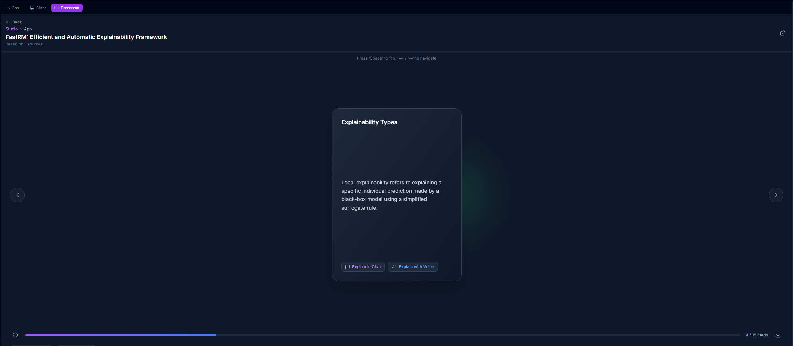 |

</details>

<details>
<summary><b>🃏 Flashcards & Quizzes</b></summary>
<br>
Auto-generate study materials from your content. Test yourself with interactive quizzes and review key concepts with flashcards.

|               Generating Flashcards                |                 Flashcards View                  |              Quiz View               |            Submit & Grade             |
| :------------------------------------------------: | :----------------------------------------------: | :----------------------------------: | :-----------------------------------: |
| 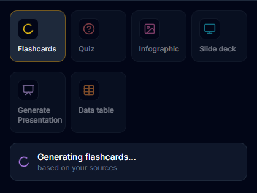 | 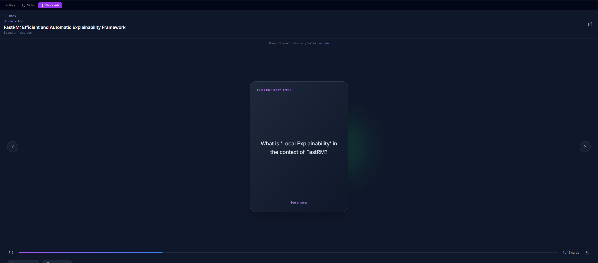 | 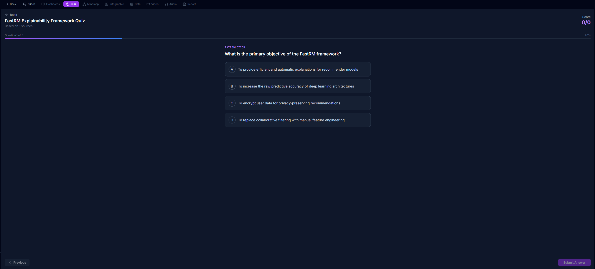 | 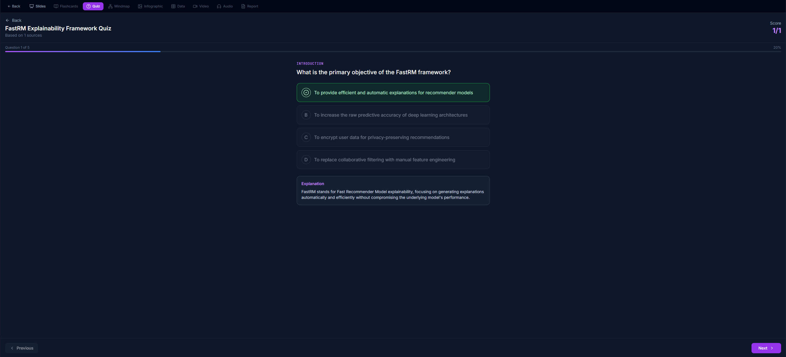 |

</details>

<details>
<summary><b>📊 Reports, Infographics & Data Tables</b></summary>
<br>
Generate comprehensive reports, visual infographics, and structured data tables from any topic.

|                  Report                  |                     Infographic                      |                    Data Table                    |
| :--------------------------------------: | :--------------------------------------------------: | :----------------------------------------------: |
| 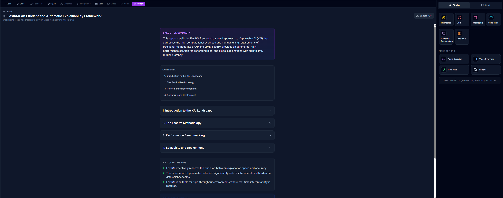 | 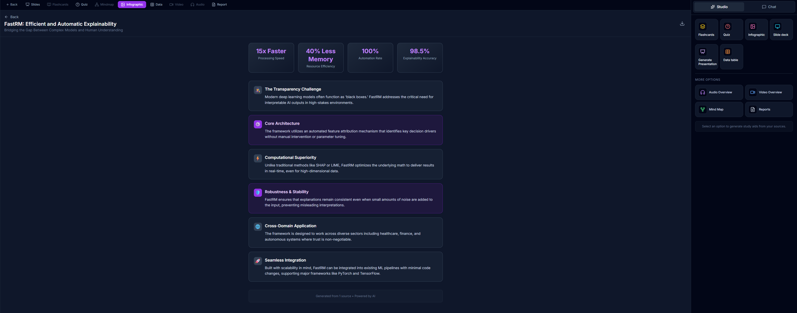 | 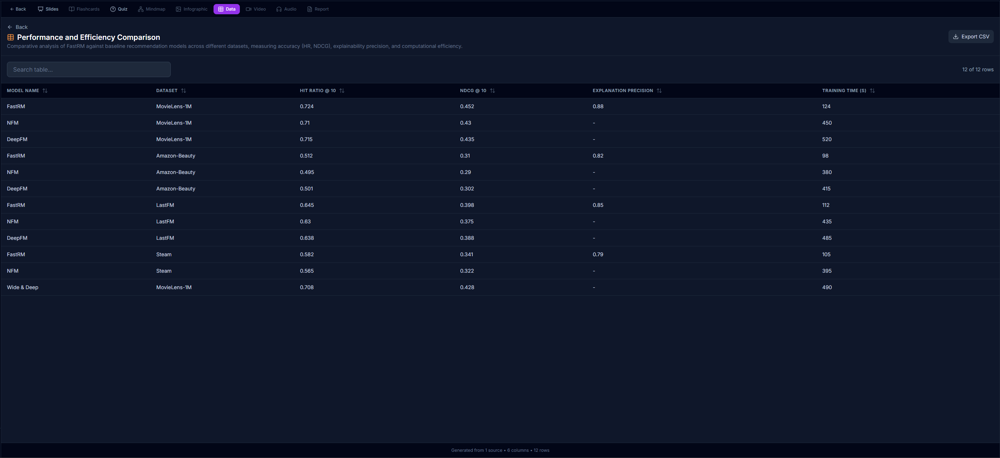 |

</details>

<details>
<summary><b>🎬 AI Video Generation</b></summary>
<br>
Ask "Make a video about this" and the system uses **Veo** to generate educational video clips on demand.

|                      Video Structure                       |                 Generated Video                  |
| :--------------------------------------------------------: | :----------------------------------------------: |
| 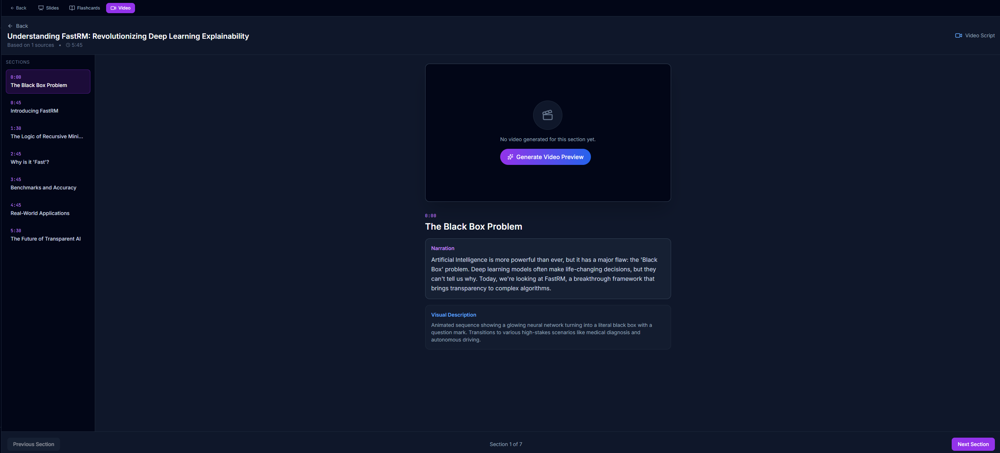 | 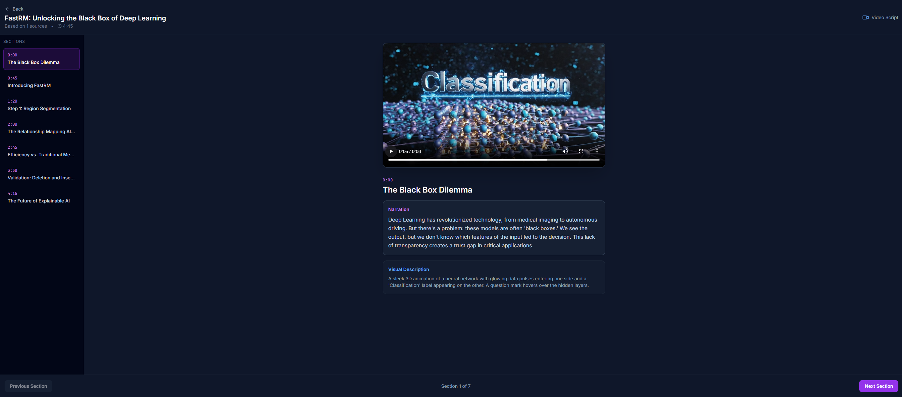 |

</details>

<details>
<summary><b>🗂️ Workspace Tabs</b></summary>
<br>
Switch between Slides, Flashcards, Quiz, Infographic, and Mind Map views without losing context.


</details>

---

## 🏗️ Architecture

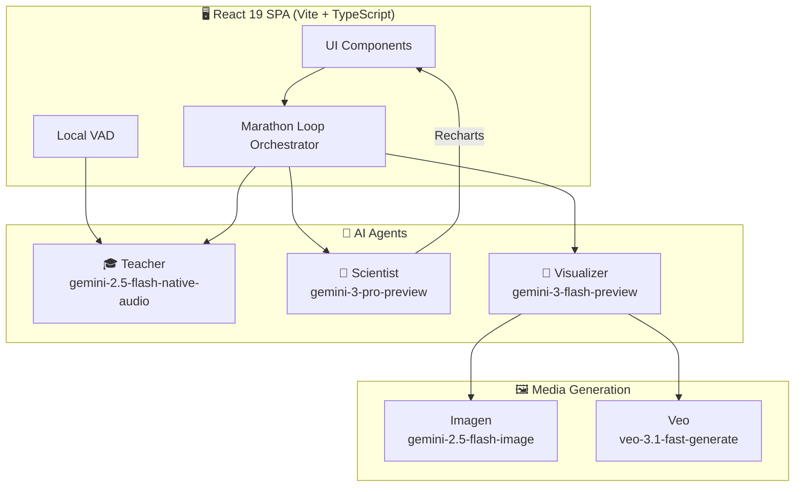

### How It Works

1. **Upload** a PDF or enter a topic
2. **Marathon Loop** analyzes intent and routes to the right agent
3. **Teacher** narrates via WebSocket audio streaming
4. **Scientist** generates Python code → renders live charts via Recharts
5. **Visualizer** creates structured content (slides, flashcards, quizzes) and media (images, videos)

---

## ⚙️ Tech Stack

| Layer          | Technology                                  |
| -------------- | ------------------------------------------- |
| **Framework**  | React 19, TypeScript, Vite 6                |
| **Styling**    | Tailwind CSS                                |
| **AI Core**    | Google Gemini API (`@google/genai`)         |
| **Voice**      | WebSocket + Native Audio (Gemini 2.5 Flash) |
| **Charts**     | Recharts                                    |
| **Export**     | PptxGenJS, html2pdf.js, FileSaver           |
| **Deployment** | GitHub Pages                                |

---

## 🚧 Challenges We Ran Into

- **🎤 Voice Interruptions ("Barge-in"):** Stopping playback _and_ clearing the audio buffer instantly when the user interrupts, using client-side VAD to prevent the AI from hearing its own output.
- **🔄 Multimodal State Sync:** Keeping the visual state (current slide) synchronized with the audio state (what the model is saying) through a complex `AutoTutorContext` state machine.
- **📋 Structured Output:** Ensuring consistent JSON from LLMs for quizzes, slides, and flashcards using Gemini's `responseSchema` and focused system instructions.

---

## 🏆 Accomplishments

- ✅ **Auto-Explain Magic** — Upload → Slide Generation → Voice Presentation, fully automated
- ✅ **Veo Integration** — On-demand educational video generation pipeline
- ✅ **Scientist Agent** — AI writes code to _prove_ a point, not just hallucinate answers
- ✅ **Natural Voice Interaction** — Real-time, interruptible voice conversation

---

## 📚 What We Learned

- **Gemini 2.5 Flash** native audio modality feels significantly more natural than stitching together STT + TTS services
- **Agent Specialization** — Splitting into Teacher, Scientist, and Visualizer yields dramatically better responses than a single-prompt approach

---

## 🔮 What's Next

- 🐍 **Real Python Runtime** — Integrate Pyodide (WebAssembly) to execute Scientist-generated code in-browser
- 👥 **Collaborative Classrooms** — Multi-user lecture rooms
- 🥽 **AR Mode** — Project visual overlays into 3D space using WebXR

---

## 🛠️ Run Locally

**Prerequisites:** Node.js v18+

```bash
# 1. Clone the repository
git clone https://github.com/Golden007-prog/Omni-Lab.git
cd Omni-Lab

# 2. Install dependencies
npm install

# 3. Configure API Key — create a .env.local file
echo "VITE_GEMINI_API_KEY=your_api_key_here" > .env.local
# Get your key from https://aistudio.google.com/

# 4. Start the dev server
npm run dev
```

---

## 🤝 Contributing

Contributions are welcome! Feel free to open an issue or submit a pull request.

1. Fork the repository
2. Create your feature branch (`git checkout -b feature/amazing-feature`)
3. Commit your changes (`git commit -m 'Add amazing feature'`)
4. Push to the branch (`git push origin feature/amazing-feature`)
5. Open a Pull Request

---

<div align="center">

**Built with ❤️ using Google Gemini**

⭐ Star this repo if you found it useful!

</div>
